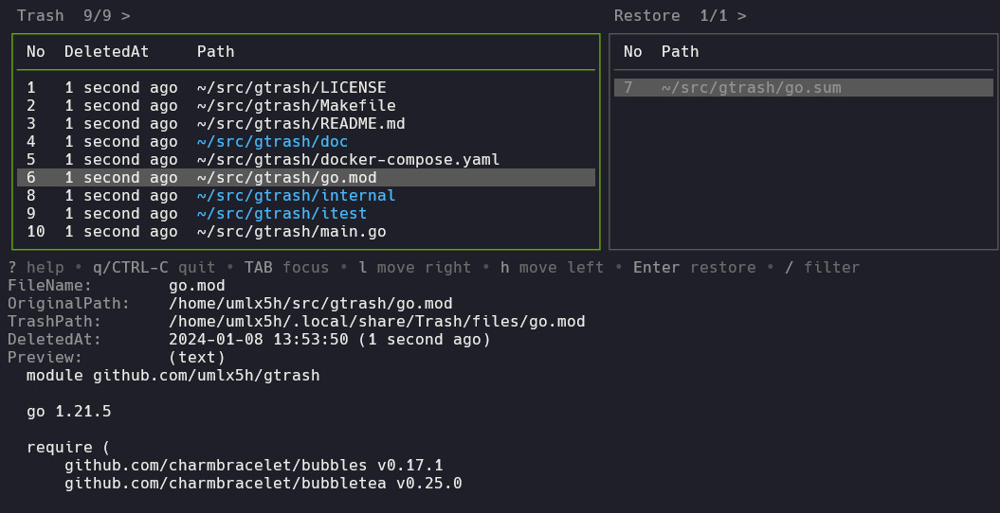

# gtrash

<h5 align="center">A Modern Trash CLI manager for Linux system trash written in Go</h5>


`gtrash` is a trash CLI manager that fully complies with the [FreeDesktop.org specification](https://specifications.freedesktop.org/trash-spec/trashspec-latest.html).  
Unlike `rm`, `gtrash` moves files to the system trash can, enabling easy restoration of important files at any time.

If you usually use `rm` in the shell, `gtrash` can serve as a substitute.

This tool utilizes the system trash can on Linux, enabling seamless integration with other CLI and desktop applications.

Additionally, `gtrash` features a modern TUI interface, making it very intuitive to restore any file.


## Table of Contents
- [Features](#features)
- [Supported OS](#supported-os)
- [Installation](#installation)
- [Usage](#usage)
- [How it works](#how-it-works)
- [FAQ](#faq)
- [Tips](#tips)
- [Configuration](#configuration)
- [Related projects](#related-projects)

## Features

- Intuitive TUI interface for file restoration
  - Allows incremental search for trashed files, enabling the restoration of multiple files simultaneously.
- Full compliance with FreeDesktop.org specification
  - Supports directory size caching, enabling fast size-based filtering and pruning.
- Close compatibility with rm interface
  - Has rm-like mode, You can customize -r, -d behavior
- Multi subcommands design in a single static binary written in Go
- Restoration of co-deleted files together
- Easy integration with other CLI tools, such as fzf
- Safe and Ergonomic
  - Ensures safety by displaying a list and confirmation prompt whenever a file is permanently deleted.


## Supported OS

- Status: Not stable, interface may change in the future.

### Linux
Supported

### Mac
Supported

but Mac's system trash can is not used

### Windows
Not supported

It works perfectly on WSL2 because it is real Linux

## Installation

### From binaries

Download the binary from [GitHub Releases](https://github.com/umlx5h/gtrash/releases/latest) and place it in your `$PATH`.

Install the latest binary to `/usr/local/bin`:

```bash
curl -L "https://github.com/umlx5h/gtrash/releases/latest/download/gtrash_$(uname -s)_$(uname -m).tar.gz" | tar xz
chmod a+x ./gtrash
sudo mv ./gtrash /usr/local/bin/gtrash
```

### Homebrew

```
brew install umlx5h/tap/gtrash
```

### Build from source

```bash
git clone https://github.com/umlx5h/gtrash.git
cd gtrash
go build
./gtrash
sudo cp ./gtrash /usr/local/bin/gtrash
```

## Usage

To trash a file, use the `put` subcommand.  
Deleting a directory doesn't require the `-r` option by default.  
(This behavior can be adjusted using --rm-mode.)

```bash
$ cd && mkdir dir && touch file1 file2
$ gtrash put dir file1 file2
```

The `summary` subcommand provides information about the trash can, displaying item count and total size.  
There is a path name, the file has been moved to this path.

```
$ gtrash summary
[/home/user/.local/share/Trash]
item: 3
size: 4.1 kB
```

The `find` subcommand lists the files in the trash.  
The `Path` field shows the original file location, not the one in the trash.

```bash
# gtrash f is also acceptable
$ gtrash find
Date                 Path
2024-01-01 00:00:00  /home/user/dir
2024-01-01 00:00:00  /home/user/file1
2024-01-01 00:00:00  /home/user/file2
```

String queries can be passed as command line arguments for searching files in the trash, using regular expressions by default.

```bash
$ gtrash find file1 dir
Date                 Path
2024-01-01 00:00:00  /home/user/dir
2024-01-01 00:00:00  /home/user/file1
```

There are several ways to restore a file.  
To restore with an interactive TUI, use the `restore` subcommand.

```bash
# gtrash r is also acceptable
$ gtrash restore
```



Within `restore`, multiple files can be selected for restoration.  

The table on the left is the list of files in the trash and the table on the right is the list to be restored.

Press `?` for detailed operations.  
Navigate using `j`, `k`, or the cursor keys.  
Use `l` or `Space` to move files to the right table.  

Vim key bindings are used.  
Incremental searches can be performed with `/`.  
Press `Enter` after selecting files to restore.
A list of selected files and a confirmation prompt will appear. Confirm restoration by pressing `y`.

```bash
$ gtrash restore
Date                 Path
2024-01-01 00:00:00  /home/user/dir
2024-01-01 00:00:00  /home/user/file1

Selected 2 trashed files
Are you sure you want to restore? yes/no
```

There is another type of restoration with TUI.  
To restore all the deleted files together in one `put` command, use the `restore-group` subcommand.

```bash
# gtrash rg is also acceptable
$ gtrash restore-group
```

In above example, `dir1`, `file1`, and `file2` can be restored together.  
This is useful when many files were deleted together but you want to restore them at once.

For non-TUI restoration, use the `--restore` option with `find`.

```bash
$ gtrash find file1 dir --restore
Date                 Path
2024-01-01 00:00:00  /home/user/dir
2024-01-01 00:00:00  /home/user/file1

Found 2 trashed files
Are you sure you want to restore? yes/no
```

To permanently delete files in the trash, use the `--rm` option with `find`.  
Be aware that this action is irreversible, akin to rm, and the files cannot be restored.

```
# Delete specific files
$ gtrash find file1 --rm

# Delete all files
$ gtrash find --rm
```

Help can be viewed with the `-h` option.
Examples are provided for each subcommand.

```
$ gtrash -h
$ gtrash put -h
```


## How it works

`gtrash` adheres to the [FreeDesktop.org specification](https://specifications.freedesktop.org/trash-spec/trashspec-latest.html).

Its primary function is akin to `mv`, but it extends functionality by recording meta-information and automatically transferring files to the trash can in the external file system.

Files within the main file system are moved to the following paths in the home directory.

```bash
# Standard
$HOME/.local/share/Trash

# If $XDG_DATA_HOME is set
$XDG_DATA_HOME/Trash
```

The files are moved to the `files` directory, while metadata is stored in the `info` directory.

```bash
$ gtrash put file1

# Records meta infomation
$ cat ~/.local/share/Trash/info/file1.trashinfo
[Trash Info]
Path=/home/user/file1
DeletionDate=2024-01-01T00:00:00

# Actual file
$ ls ~/.local/share/Trash/files/file1
/home/user/.local/share/Trash/files/file1
```

Files within an external file system will be moved to either of the subsequent paths.

```bash
# If a .Trash folder already exists, it will be used.
# ($uid folder is created automatically)
# The .Trash directory requires a sticky bit set (can be added using chmod +t)
$MOUNTPOINT/.Trash/$uid

# Used when the above directory is unavailable (typically used)
$MOUNTPOINT/.Trash-$uid
```

To use the first directory, create a `.Trash` directory in advance:

```bash
# You can check with the df command
$ cd $MOUNTPOINT

$ mkdir .Trash
$ chmod a+rw .Trash

# Set the sticky bit
$ chmod +t .Trash
```

`$MOUNTPOINT` is the same as the information displayed in the `df` command.

```
# Mounted on
$ df foo
Filesystem Size  Used Avail Use% Mounted on
/dev/sda   54G   48G  3.6G  93% /
```

The `mv` command copies and deletes files when moving across file systems.  
This process consumes more time and increases disk usage on the destination file system.  

The inability to use the [rename(2)](https://man7.org/linux/man-pages/man2/rename.2.html) syscall across different file systems necessitates this behavior.

For this reason, `gtrash` attempts to move files to the trash can within the same file system whenever possible.  
You can also configure it to always use the trash can in the `$HOME` directory.

Refer to the [Configuration](doc/configuration.md) for further details.

The `summary` subcommand lists paths to all trash cans:

```bash
$ gtrash summary
```

Using the `--show-trashpath` option with the `find` command displays the real path for each trashed file.

```bash
$ gtrash find --show-trashpath
```

For detailed behavior insights, run the command with the `--debug` option to view internal processes.


## FAQ
### What's the difference between this command and the rm command?

While `rm` uses the [unlink](https://man7.org/linux/man-pages/man2/unlink.2.html) syscall, rendering file deletion irreversible, `gtrash` moves files using the [rename](https://man7.org/linux/man-pages/man2/rename.2.html) syscall, enabling restoration.

`gtrash` aims to mirror the `rm` interface but ignores `-r`, `-R`, `--recursive`, and `-d` by default.

```bash
$ gtrash put -h
Flags:
  -d, --dir             ignored unless --rm-mode set
  -f, --force           ignore nonexistent files and arguments
  -i, --interactive     prompt before every removal
  -I                    prompt once before trashing
  -r, -R, --recursive   ignored unless --rm-mode set
      --rm-mode         enable rm-like mode (change behavior -r, -R, -d)
  -v, --verbose         explain what is being done
```

The `-r` option is not necessary for deleting folders since files are restorable even if mistakenly removed.

However, some users may prefer the `rm` behavior. In such cases, enable the above option with `--rm-mode`.
(Although it is not completely compatible.)

```bash
# To delete a folder, -r or -d is required.
$ gtrash put --rm-mode dir1/
gtrash: cannot remove "dir1/": Is a directory

$ gtrash put --rm-mode -r dir1/
```

This behavior can be set using an environment variable or an alias, whichever suits your preference.

```
# Same as --rm-mode
$ GTRASH_PUT_RM_MODE="true" gtrash put -r dir/

# Alias is also possible
$ alias gtrash-put="gtrash put --rm-mode"
```

### What are the advantages of using a system trash can?

`gtrash` offers several benefits over similar applications like [rip](https://github.com/nivekuil/rip) that don't utilize the Linux system trash can.

* Seamless integration with CLI and desktop applications following the FreeDesktop specification.
* Support for various trash cans, even on different file systems, enabling fast file movement between them.
* Compatibility with standard specifications ensures smoother migration to alternative applications adhering to the same standards.
  * Unique specifications become a problem when they are no longer maintained.

### Can I alias `rm=gtrash put`?

Not recommended due to potential risks, unintentionally executing actual `rm` commands, especially with `sudo rm` or on SSH servers.

As `gtrash` isn't fully compatible with `rm`, it's prudent to establish different aliases to avoid confusion and prevent accidental deletion of files.

Consider setting up alternative aliases, such as:

```bash
alias gp='gtrash put'
alias gm='gtrash put'
alias tp='gtrash put'
alias tm='gtrash put'
```

If you are in the habit of using rm, consider creating an alias that displays a cautionary message.

```bash
alias rm="echo -e 'If you want to use rm really, then use \"\\\\rm\" instead.'; false"
```

When you want to execute the actual rm, use `\rm` to bypass the alias.

```bash
$ rm foo
If you want to use rm really, then use "\rm" instead.

$ \rm foo
```

### Can I run `trash put` in one command without using alias?

In certain situations, supporting trash cans within programs might necessitate working with a trash CLI without the ability to specify a subcommand like `gtrash put`.

In such cases, consider a simple wrapper script.

```bash
# Locate gtrash binary path
$ which gtrash
/usr/local/bin/gtrash

$ sudo vim /usr/local/bin/gtrash-put
#!/bin/sh

# Specify gtrash binary path
exec /usr/local/bin/gtrash put "$@"

$ sudo chmod a+x /usr/local/bin/gtrash-put
```

With this setup, execute a single command.

```bash
$ gtrash-put somefile
```

This wrapper facilitates direct execution without needing an alias.

### Typing `gtrash` takes too long

Set up an different alias from put.

Example
```bash
alias gp="gtrash put"
alias g="gtrash"
```

You can also change the binary name from the default if you prefer.  
(However, the binary must be manually copied to be installed.)

### What happens when I run it with sudo?

Files are moved to the Trash under the `root` user's home directory.

```
$ sudo bash -c 'echo $HOME'
/root
```

The `-v` option displays the location where the file was moved.

```
$ sudo gtrash put -v file1
trashed "file1" to /root/.local/share/Trash
```

The `summary` subcommand can also reveal the Trash can location.
```
$ sudo gtrash summary
[/root/.local/share/Trash]
item: 10
size: 62 kB
```

To restore or delete a file deleted with sudo, you need to use sudo.

### How does the `restore-group` subcommand work?

The `restore-group` subcommand can restore multiple deleted files simultaneously with one command.

```bash
$ gtrash put file1 file2 dir

# You can restore file1, file2, dir together
$ gtrash restore-group
```

However, it's not an exact grouping of files deleted at the same time.  
Files with the same deletion timestamp recorded in seconds are simply grouped together.

When files are trashed using `gtrash put`, they are designed to have the same timestamp, allowing reliable grouping.  
But this isn't guaranteed if trashed via other apps.

Note that multiple `gtrash put` commands executed within one second are also grouped together.

In an interactive shell executing `gtrash put`, timestamps rarely match within seconds. However, caution is needed when running it via a shell script.

In such cases, use the `restore` subcommand to select specific files.

### What does the `metafix` subcommand do?

`trash put` command records meta-information in the `info` folder in the Trash directory and moves files to the `files` directory.

```bash
$ gtrash put file1

# Records meta infomation
$ cat ~/.local/share/Trash/info/file1.trashinfo
[Trash Info]
Path=/home/user/file1
DeletionDate=2024-01-01T00:00:00

# Actual file
$ ls ~/.local/share/Trash/files/file1
/home/user/.local/share/Trash/files/file1
```

For instance, if you manually delete files from the `files` directory, the trash will become inconsistent.

```bash
# Deletes the file only, not the meta info
$ rm ~/.local/share/Trash/files/file1
```

In such cases, `find` and `restore` commands won't display inconsistent orphaned meta-information.

`metafix` can detect this condition and remove unnecessary meta-information.

```bash
$ gtrash metafix
Date                 Path
2024-01-01 00:00:00  /home/user/file1

Found invalid metadata: 1
Are you sure you want to remove invalid metadata? yes/no
```

The following trashinfo file will be deleted instead of the file.

```bash
$ ls ~/.local/share/Trash/info/file1.trashinfo
ls: cannot access '/home/user/.local/share/Trash/info/file1.trashinfo': No such file or directory
```

### The display in the TUI is corrupted

It seems that the table in TUI may be corrupted on certain terminals.  
The display of the library used itself may be corrupted and may not be able to be fixed.  
In that case, I recommend migrating the terminal.

Terminal confirmed that it cannot be fixed
* KDE Konsole

Terminal confirmed to work
* Wezterm
* Alacritty
* Kitty
* GNOME Terminal
* Xfce Terminal
* Windows Terminal
* Mac Terminal
* Mac iTerm2

If you find a problem, please open an ticket.

## Tips

### Filtering by the current working directory or specific directory

By default, `find` and `restore` display all files, not limited to the current directory.  
This differs from other applications.

You can filter using the `-c` option (`--cwd`).

```bash
# --cwd is also acceptable
$ gtrash find -c
$ gtrash restore -c
```

The `restore` subcommand also supports filtering by the current directory in the TUI.

Avoid using `-c`, directly access the TUI, and press the `c` key to toggle filtering.

```bash
$ gtrash restore

# Press the c key
```

The `-d` or `--directory` option allows filtering in directories other than the current one.

```bash
# Specify an absolute path
$ gtrash find -d /tmp

# relative path is also supported
$ gtrash find -d ./foo

# Same as -c
$ gtrash find -d .
```

### Fuzzy find

Fuzzy find isn't currently implemented due to complexity.  
However, `gtrash` is designed to work seamlessly with other commands like fzf.

The find subcommand outputs a tab-delimited table if it detects pipe or file output other than a terminal.  
This enables easy field extraction using tools like awk.

Example with fzf:

```bash
# Fuzzy find one item and get the original path
# Specify -F'\t' due to tab-delimited output
$ gtrash find | fzf | awk -F'\t' '{print $2}'

# Fuzzy find multiple items and get the original path
$ gtrash find | fzf --multi | awk -F'\t' '{print $2}'
```

For permanent removal or restoration, specify the original path as a command-line argument in the `rm` or `restore` subcommand.  
Note that the `-o` option must be specified when using `xargs` to display the confirmation prompt.

```bash
# Fuzzy find multiple items and permanently remove them
$ gtrash find | fzf --multi | awk -F'\t' '{print $2}' | xargs -o gtrash rm

# Fuzzy find multiple items and restore them
$ gtrash find | fzf --multi | awk -F'\t' '{print $2}' | xargs -o gtrash restore
```

### Pruning the trash can by size and date criteria

Date-based:

Currently possible only by day.

```bash
# Remove files deleted over a week ago
$ gtrash find --day-old 7 --rm

# Remove files deleted within the last 24 hours
$ gtrash find --day-new 1 --rm
```

Size-based:
```bash
# Remove trashed files larger than 10MB
$ gtrash find --size-large 10mb --rm

# '10m' is also acceptable
$ gtrash find --size-large 10m --rm

# Remove trashed files larger than 1GB
$ gtrash find --size-large 1gb --rm

# Remove empty trashed files
$ gtrash find --size-small 0 --rm
```

Sizes and dates can be combined, and other filters can be applied.

```bash
# Remove files older than a week and larger than 10MB
$ gtrash find --day-old 7 --size-large 10mb --rm

# Remove files older than a week, larger than 10MB, and containing 'foo' in the path
$ gtrash find --day-old 7 --size-large 10mb --rm foo
```

## Configuration

Certain behaviors can be altered by setting environment variables.  
Refer to the [Configuration](doc/configuration.md).

## Related projects

* [andreafrancia/trash-cli](https://github.com/andreafrancia/trash-cli)
* [oberblastmeister/trashy](https://github.com/oberblastmeister/trashy)
* [rushsteve1/trash-d](https://github.com/rushsteve1/trash-d)

[Comparison Table](doc/alternatives.md)
